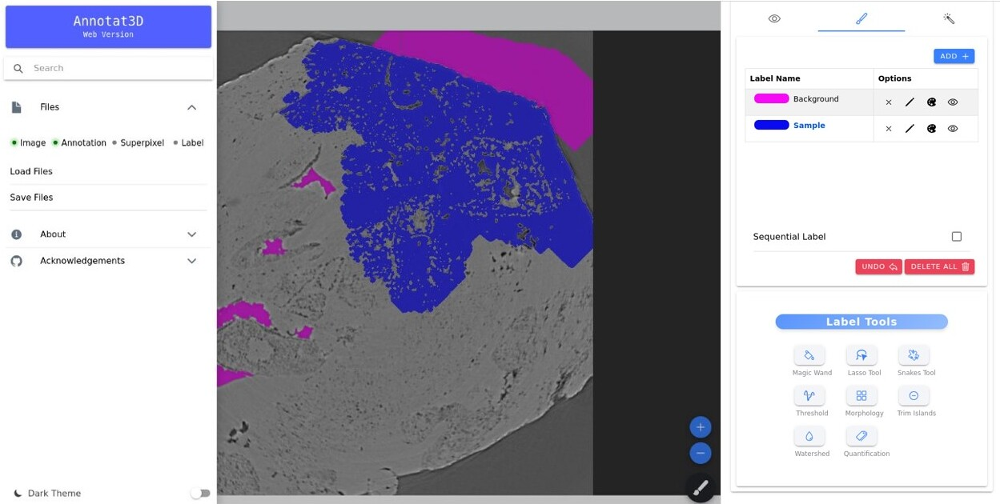

# Annotat3D

**Annotat3D** is a modern web application designed for interactive segmentation of volumetric images, tailored to meet the needs of the imaging beamlines at [Sirius](https://lnls.cnpem.br/sirius-en/).




## ✨ Key Features

Annotat3D leverages human-in-the-loop strategies to facilitate the annotation of large tomographic datasets, enabling domain experts to inject their knowledge efficiently while collaborating with machine learning models. Here are the main features of Annotat3D:

- **High-Performance Image Segmentation**: Optimized for multi-GPU clusters, enabling efficient processing of large-scale datasets.
- **Intuitive Web Interface**: Provides tools for annotating, correcting, and managing labels in an accessible and user-friendly environment.
- **Real-Time Visualization**: Offers low-latency visualization of raw data, annotations, and predictions to ensure immediate feedback and streamlined workflows.
- **Advanced Filtering Tools**: A comprehensive suite of high-performance filters designed for HPC environments, enhancing image quality and reducing noise with exceptional speed and precision.
- **Active Contour Models**: Seamless automatic annotation and label correction powered by active contour models, improving efficiency and accuracy in label refinement.
- **HPC-Optimized Morphological Operations**: A robust suite of morphological operations, specifically implemented for HPC environments, to refine segmentation with precision and scalability.

---

## Project Status

Actively developed with new features and performance improvements planned.

---

## Quick Start

Annotat3D supports both desktop use and HPC environments.

### Option 1: Run Pre-Built Docker Image (Recommended)

```bash
docker pull docker.io/allansp84/annotat3d-prod:latest
docker run -d -p 8000:8000 annotat3dweb-prod:latest
```

Access at:

```
http://localhost:8000
```

### Option 2: Build Docker

```bash
git clone https://github.com/cnpem/annotat3d.git
cd annotat3d
bash container/build-docker-local.sh
docker run -d -p 8000:8000 annotat3-prod:local
```

Access at:

```
http://localhost:8000
```

### Option 3: Build Singularity (HPC Friendly)

```bash
git clone https://github.com/cnpem/annotat3d.git
cd annotat3d
bash container/build-singularity-local.sh base
bash container/build-singularity-local.sh production
singularity run --nv annotat3d-prod-local.sif
```

Access:

```
http://localhost:8000
```

---

## 📘 Documentation

### Run Docs from Container

```bash
docker pull allansp84/annotat3d-documentation:latest
docker run --rm -it -p 3000:3000 \
    -e PORT=3000 \
    -e HOST=0.0.0.0 \
    -e CI=true \
    allansp84/annotat3d-documentation:latest
```

or build locally:

```bash
cd docs
docker compose up -d --build
```

Docs available at:

```
http://localhost:3000
```

---

## Usage

### Users

1. Load a volumetric dataset in `.h5` format via the GUI.
2. Annotate slices using the interactive tools.
3. Use machine learning-powered segmentation and preview results.
4. Export results

### Developers

Contributions are welcome!
See the **Developer Guide**:

👉 [`DEVELOPER.md`](./DEVELOPER.md)

---

## Need Help?

If you need help, please open an Issue or Discussion.
Enjoy Annotat3D!

---

## Contributors

- Allan Pinto - <allan.pinto@lnls.br>
- Camila Machado de Araújo - <camila.araujo@lnls.br>
- Egon Borges - <egon.borges@lnls.br>
- Ricardo Grangeiro - <ricardo.grangeiro@lnls.br>

---

## License

This project is licensed under the **GNU General Public License v3.0**.

### Summary of the License
- You are free to:
  - **Use**: Run the software for any purpose.
  - **Study**: Access and modify the source code.
  - **Share**: Distribute copies of the software.
  - **Contribute**: Distribute modified versions of the software.

- Requirements:
  - If you distribute copies or modified versions, you **must make the source code available** under the same license.
  - Any changes you make to the software must be clearly documented.
  - You **cannot add restrictions** that would deny other users the freedoms granted by this license.

For more details, see the full license text in the [`LICENSE`](./LICENSE) file or visit the [GNU GPL v3.0](https://www.gnu.org/licenses/gpl-3.0.en.html) page.

By using or modifying this software, you agree to the terms and conditions outlined in the license.
